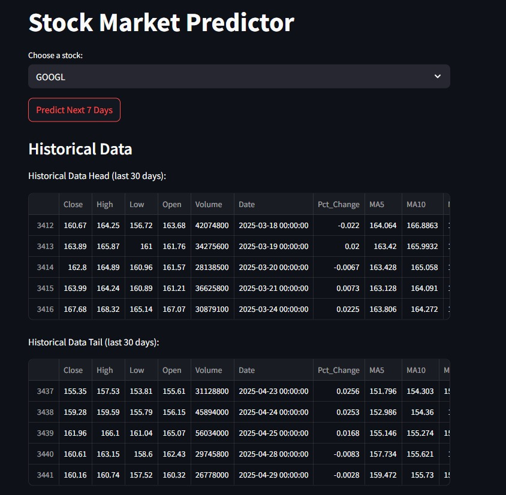
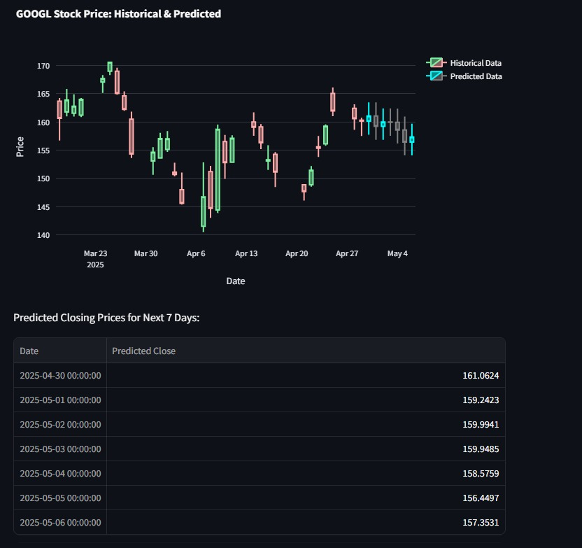
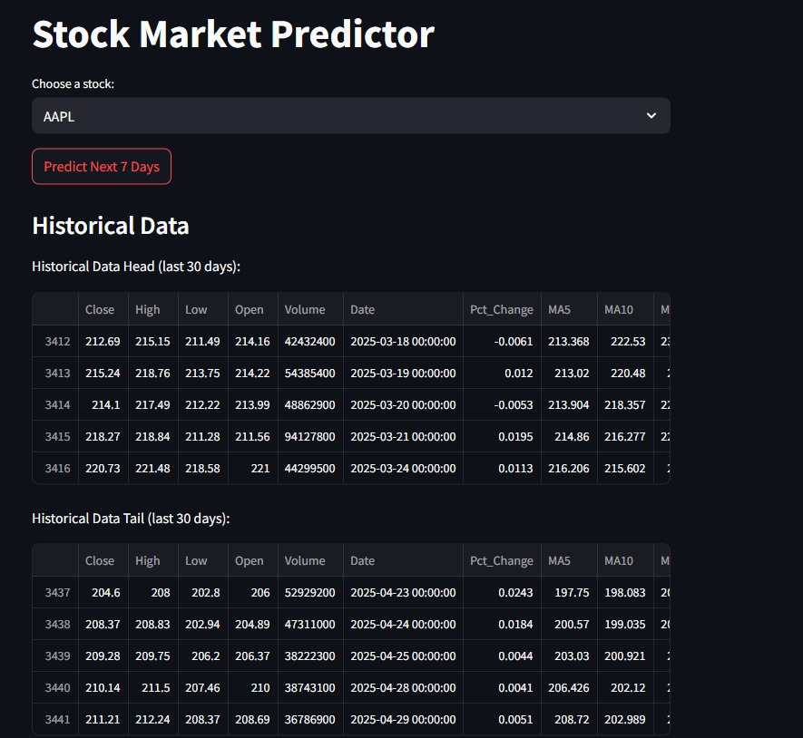
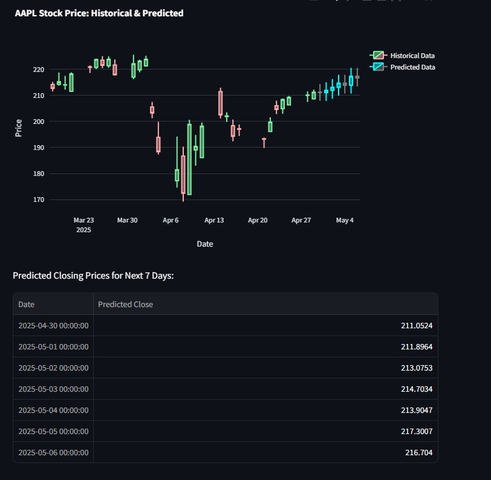
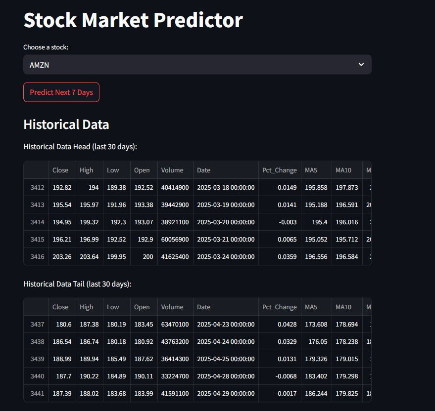
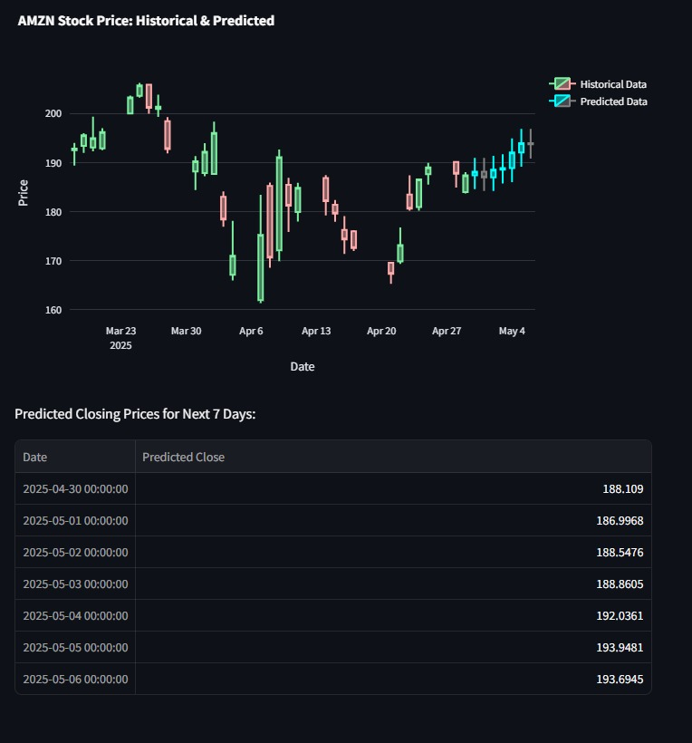

# Stock Market Predictor 📈

This project is a Stock Market Predictor application that forecasts stock prices for the next 7 days. It utilizes historical stock data, processes it, trains a Long Short-Term Memory (LSTM) model, and presents the predictions through an interactive web interface built with Streamlit and an API built with FastAPI.

## Table of Contents
- [Overview](#overview)
- [Key Features](#key-features)
- [Screenshots](#screenshots)
- [Technologies Used](#technologies-used)
- [Future Enhancements](#future-enhancements)

---

## Overview

The Stock Market Predictor aims to provide users with an insight into potential future stock price movements.
The application:
1.  Fetches historical stock data for a selected ticker symbol using the `yfinance` library.
2.  Preprocesses the data by calculating technical indicators like Percentage Change and Moving Averages (MA5, MA10, MA20).
3.  Scales the features and prepares sequences for the LSTM model.
4.  Builds and trains a Bidirectional LSTM model using TensorFlow/Keras to understand patterns in the historical data.
5.  The Streamlit interface allows users to select a stock and view historical data alongside a 7-day price projection displayed on a Plotly candlestick chart.
6.  A FastAPI backend provides an API endpoint to get these 7-day projections.

---

## Key Features ✨

* **Historical Data Fetching**: Downloads up to 5000 days of historical stock data.
* **Technical Indicators**: Calculates Pct_Change, MA5, MA10, and MA20 as features.
* **LSTM Model Training**: Implements a Bidirectional LSTM network for time-series forecasting. The model is trained each time a prediction is requested.
* **7-Day Price Projection**: Generates a projection for the next 7 days' closing prices. (See [Prediction Methodology Note](#prediction-methodology-note)).
* **Interactive UI**: User-friendly interface built with Streamlit to select stocks and visualize data.
* **Candlestick Charts**: Displays historical data and predicted data using Plotly for clear visualization.
* **API Access**: Provides a FastAPI endpoint (`/predict`) for programmatic access to stock predictions.

---

## Screenshots 📸

**Example: Historical Data and Prediction for GOOGL**

**Example: Historical Data and Prediction for AAPL**

**Example: Historical Data and Prediction for AMZN**

---

## Technologies Used 🛠️

* **Python**: Core programming language.
* **FastAPI**: For building the prediction API.
* **Streamlit**: For creating the interactive web application.
* **TensorFlow (Keras)**: For building and training the LSTM model.
* **Scikit-learn**: For data preprocessing (MinMaxScaler, train_test_split).
* **Pandas**: For data manipulation and analysis.
* **NumPy**: For numerical operations.
* **yfinance**: For fetching historical stock market data.
* **Plotly**: For creating interactive candlestick charts.
* **Uvicorn**: ASGI server for running FastAPI.

---

## Future Enhancements 💡

* **True Iterative LSTM Prediction**: Modify `predict_next_7_days` to use the trained LSTM model iteratively:
    * Predict Day 1 using the last known sequence.
    * Use the predicted Day 1 price to calculate its features (Pct_Change, MAs).
    * Append these new features to the sequence to predict Day 2, and so on for 7 days.
    * This would involve inverse scaling predicted outputs and re-scaling new inputs for the model at each step.
* **Model Persistence**: Save and load trained models to avoid retraining for every request, speeding up predictions for frequently accessed stocks.
* **Hyperparameter Tuning**: Optimize LSTM model parameters (layers, units, dropout rates, epochs, batch size) for better performance.
* **Advanced Feature Engineering**: Incorporate more technical indicators (e.g., RSI, MACD, Bollinger Bands) or sentiment analysis from news.
* **Error Metrics**: Display model performance metrics (e.g., RMSE, MAE) on test data.
* **User-Defined Prediction Horizon**: Allow users to specify the number of days for prediction.
* **Batch Predictions**: Allow predicting for multiple stocks at once.
* **Deployment**: Deploy the application to a cloud platform (e.g., Heroku, AWS, Google Cloud).
* **Enhanced Error Handling & Logging**: Implement more robust error handling and logging throughout the application.
